= SpringBean子类替换实现逻辑扩展
:lang: zh_CN
:toc:
:toclevels: 5
:sectnums:
:sectnumlevels: 5

一般使用只看背景,使用和常见问题部分即可. 如果需要详细了解原理,可深入看需求分析与实现细节.

== 背景
项目二开扩展逻辑不可避免,当前很多项目都基于spring boot,所以可以基于spring bean替换实现逻辑扩展.

== 使用
=== 引入starter依赖
replace-bean.version可选用最新版本.
[source,xml]
----
<dependency>
    <groupId>io.github.xiejx618</groupId>
    <artifactId>replace-bean-boot-starter</artifactId>
    <version>${replace-bean.version}</version>
</dependency>
----

=== 注册
==== 方式一：通过工厂类.在工厂方法上使用@Replace注解
[source,java]
----
//1.继承父类重写方法扩展逻辑
public class HelloServiceExt extends HelloService {

    public void sayHello() {
        System.out.println("sub hello world!");
        test();
    }

    private void test() {
        System.out.println("sub HelloService.test");
    }
}

//2.在工厂方法上使用@Replace注册
public class ReplaceBeanConfig {
    private BeanFactory beanFactory;
    private Environment environment;

    @Replace(order = -2)
    public HelloService helloService() {
        return new HelloServiceExt();
    }
}
----
上面的beanFactory和environment会自动注入,供实例bean时使用. 此方式理论上可以替换更多的Bean.

==== 方式二：通过扫描包.在扩展子类上直接使用@Replace注解
[source,java]
----
@Replace(order = -2)
public class HelloServiceExt extends HelloService {

    public void sayHello() {
        System.out.println("sub hello world!");
        test();
    }

    private void test() {
        System.out.println("sub HelloService.test");
    }
}
----
此方式会替换bean实现化的beanClass,简单直接不用考虑如何实例化bean对象

=== 配置
放在spring配置文件或配置中心中配置
[source,yaml]
----
replace:
  # 默认值true, 是否启用功能
  enabled: true
  # 扫描替换Bean包名:可为空, 多个时使用英文逗号分割
  packages: io.github.xiejx618.replace.demo.ext
  # 替换工厂配置类:可为空, 多个时使用英文逗号分割
  factories: io.github.xiejx618.replace.demo.ReplaceBeanConfig
----

=== 最佳实践
. 源码开发逻辑应将可能要扩展的实例成员(包括字段与方法)定义为protected或public,供子类使用.
. 扩展代码统一放到某个包下面, 这样可以缩小扫描范围,加快扫描速度;另一方面查阅代码时,可以快速定位扩展逻辑.
. 优先在子类上直接使用@Replace注解,当不满足时,再考虑使用工厂方法(比如替换@Bean声明的Bean,只能使用工厂方法). @Replace可以不指定BeanName和排序值时,建议不指定.

== 常见问题
=== 适用那些项目场景?
以Spring Boot为基础的项目, 通过@Component,@Service,@Repository,@Controller,@Bean等声明的Bean都可以替换. 其他方式注册的Bean应该通过工厂方法也可以替换.

=== 通过@Bean声明的Bean如何替换?
此类Bean实例时不是通过bean定义的beanClass实例化,而是通过bean工厂方法实例化,工厂实例化方式优先于beanClass实例化,即使替换了beanClass也无法替换bean逻辑. 所以此类Bean可以通过工厂方法实现替换,即是上面的方式一.

=== 支持JDK,SpringBoot那些版本,Spring AOT是否也支持?
JDK1.8和JDK17已验证可行; SpringBoot2.5.15,SpringBoot2.7.17,SpringBoot3.1.5已验证可行; Spring AOT也验证可行; 没验证的版本理论上也可行.

=== 使用了Spring Cloud的@RefreshScope的Bean如何替换?
这类bean会使用原beanName注册一个代理bean,同时也会注册一个"scopedTarget.+原beanName"的目标bean.在调用代理bean的时候,最终会调用目标bean,所以替换目标bean就可以. 注册到此组件的beanName还是应使用原beanName,组件会去掉"scopedTarget."获取替换信息.

== 需求分析
需求分析和实现细节为选看内容,有几点需要考虑:a.从spring容器(无论是按名称还是按类型)获取当前Bean必须为替换后的Bean; b.如果某个Bean依赖之前的Bean,那之前的Bean也必须为替换后的Bean; c.无论单例或多例Bean,都应为替换后的Bean; d.一个Bean可以被多次替换;

=== 寻找替换切入点
针对某个bean的生命周期主要如下:

应用上下文主要过程如下：
----
// 1.刷新上下文环境
prepareRefresh();
// 2.初始化 beanFactory，对配置文件进行解读
ConfigurableListableBeanFactory beanFactory = obtainFreshBeanFactory();
// 3.对 beanFactory 进行功能扩展
prepareBeanFactory(beanFactory);
// 4.专门留给子类作扩展用，这是一个空的方法
postProcessBeanFactory(beanFactory);
// 5.注册并执行 BeanFactoryPostProcessor 后置处理器
invokeBeanFactoryPostProcessors(beanFactory);
// 6.注册 BeanPostProcessor 后置处理器，在 getBean() 创建 bean 时调用
registerBeanPostProcessors(beanFactory);
// 7.初始化 Message 源，即不同语言消息体，国际化处理
initMessageSource();
// 8.注册多播器，事件监听器的管理者
initApplicationEventMulticaster();
// 9.专门留给子类初始化其它 bean 用，这是一个空的方法
onRefresh();
// 10.注册监听器
registerListeners();
// 11.初始化剩余的 bean (部分在 invokeBeanFactoryPostProcessors 已经初始化)
finishBeanFactoryInitialization(beanFactory);
// 12.完成刷新，通知生命周期处理器 LifecycleProcessor 刷新过程，同时发布 ContextRefreshedEvent 通知别人
finishRefresh();
----
. 单例Bean实例初始化一次,多次获取都为同一个对象; 多例Bean,多次获取会多次实例初始化;
. Bean的生命周期并不是对齐上面过程, 因此并不能简单只看上下文运行过程.
. Bean的注册可能在上面过程的beanFactory准备好后的任意某个点，bean的初始化(getBean)也有可能出现在上面过程的某个点.
. 焦点在于Bean的生命周期实例化之前阶段(上面的阶段6),上面的阶段1-3不在getBean内.
. 所以,范围缩小在阶段4-6找切入点(回调或勾子). 针对已有的切入点,最终找出InstantiationAwareBeanPostProcessor的postProcessBeforeInstantiation阶段修改逻辑比较适合.

只有向spring容器注册了InstantiationAwareBeanPostProcessor,getBean时才会让注入的逻辑生效且越早越好.

=== 替换bean核心
方式一:通过instanceSupplier自定义直接的实例给spring.这种方式更强大.spring是优先通过这种方式获取bean实例.

方式二:通过修改Bean的注册定义的BeanClass,后续就直接使用替换后BeanClass通过反射的方式实例化.这种方式很多时候是比较简单,但是如果原来的Bean是工厂方式的话,就无法直接替换了.

=== 如何让切入点生效
结合spring boot实现插件比较合适, 所以回到spring boot的启动过程org.springframework.boot.SpringApplication.run(java.lang.String...)
----
//....
// 1.封装启动参数,准备环境,打印banner
ApplicationArguments applicationArguments = new DefaultApplicationArguments(args);
ConfigurableEnvironment environment = prepareEnvironment(listeners, bootstrapContext, applicationArguments);
configureIgnoreBeanInfo(environment);
Banner printedBanner = printBanner(environment);
// 2.创建上下文
context = createApplicationContext();
context.setApplicationStartup(this.applicationStartup);
// 3.准备上下文,刷新上下文
prepareContext(bootstrapContext, context, environment, listeners, applicationArguments, printedBanner);
refreshContext(context);
// 4.刷新后回调
afterRefresh(context, applicationArguments);
Duration timeTakenToStartup = Duration.ofNanos(System.nanoTime() - startTime);
if (this.logStartupInfo) {
    new StartupInfoLogger(this.mainApplicationClass).logStarted(getApplicationLog(), timeTakenToStartup);
}
listeners.started(context, timeTakenToStartup);
callRunners(context, applicationArguments);
//...
----
InstantiationAwareBeanPostProcessor依赖于Spring容器(BeanFactory),不能早于它的创建,所以重点关注在于上面的第3点,如果prepareContext()能满足,就不用理会refreshContext().
----
//...
postProcessApplicationContext(context);
applyInitializers(context);
listeners.contextPrepared(context);
bootstrapContext.close(context);
//....
----
从中可以看出initializers和listeners是关键,这里提供了回调钩子. 通过SPI机制扩展, 这里选用了org.springframework.context.ApplicationContextInitializer实现配置和spring容器的获取,最后将InstantiationAwareBeanPostProcessor注册到spring容器.

== 实现细节(问题考虑)
.  下面就是修改BeanDefinition的逻辑
+
----
public Object postProcessBeforeInstantiation(Class<?> beanClass, String beanName) throws BeansException {
    ReplaceInfo replaceInfo = replaceMap.get(beanName);
    if (replaceInfo != null) {
        BeanDefinition beanDefinition = beanFactory.getMergedBeanDefinition(beanName);
        Method method = replaceInfo.getMethod();
        Object factory = replaceInfo.getFactory();
        String clazz = replaceInfo.getClazz();
        if (method != null && factory != null) {
            //通过工厂方法直接生成实例
            if (beanDefinition instanceof AbstractBeanDefinition) {
                Supplier<?> instanceSupplier = () -> ReflectionUtils.invokeMethod(method, factory);
                ((AbstractBeanDefinition) beanDefinition).setInstanceSupplier(instanceSupplier);
            } else {
                throw new IllegalStateException("不支持的BeanDefinition类型:" + beanDefinition.getClass());
            }
        } else if (StringUtils.hasText(clazz)) {
            //通过beanClass反射生成实例
            beanDefinition.setBeanClassName(clazz);
            if (beanDefinition instanceof AbstractBeanDefinition) {
                //为了兼容spring aot,强制不使用InstanceSupplier
                ((AbstractBeanDefinition) beanDefinition).setInstanceSupplier(null);
            }
        } else {
            throw new IllegalStateException("method和clazz为空,替换失败");
        }
    }
    return InstantiationAwareBeanPostProcessor.super.postProcessBeforeInstantiation(beanClass, beanName);
}
----

. bean实例化用的是MergedBeanDefinition,所以使用beanFactory.getMergedBeanDefinition,而不是beanFactory.getBeanDefinition

. 如果一个bean被多个子类继承,或多层次继承. 每次注册时,会比较排序,只有当前排序值比现值还小,才会替换注册,最终以优先级小的bean替换为准.